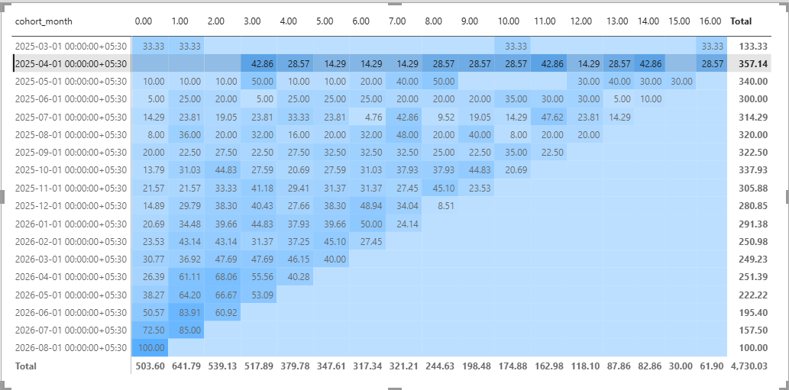

# Quick-Commerce Retention & Cohort Analysis

A PostgreSQL-based cohort and retention analysis on a quick-commerce delivery app dataset.

## Overview
This project answers one core question: **once a user signs up, how many keep
ordering — and for how long before they stop?**

Users are grouped into monthly cohorts by signup date, then tracked across
subsequent months to measure retention decay, compare retention across signup
channels, and define a churn rule.

## Tools & Tech
- **PostgreSQL** — all analysis done in raw SQL
- **VS Code** — with SQLTools + PostgreSQL extensions
- **Power BI** — retention heatmap visualization
- **Git** — version control

## Techniques used
- Cohort construction with `DATE_TRUNC`
- Self-joins between users and orders on `user_id`
- Window functions (`SUM() OVER`) for cumulative signup tracking
- `AGE()` + `EXTRACT()` for accurate month-based period calculation
  (chosen over simple date subtraction, since calendar months aren't a fixed
  number of days)
- CTEs (Common Table Expressions) to break complex logic into readable,
  testable stages
- `COUNT(DISTINCT ...)` to correctly count unique retained users, not raw order rows

## Project structure

## Methodology summary
1. **Cohort assignment** — users grouped by the month they signed up.
2. **Period calculation** — for every order, calculated how many months after
   the user's own cohort start that order occurred.
3. **Retention aggregation** — for each (cohort, period) pair, counted distinct
   users who placed at least one order, divided by original cohort size.
4. **Granularity decision** — weekly cohorts were tried first, but abandoned:
   sample sizes were too small (often under 15 users per cohort), producing
   unreliable, noisy retention percentages. Monthly cohorts gave stable results.
5. **Segment comparison** — retention compared across signup channels
   (organic, paid_ad, referral, social), pooled across all months to keep
   sample sizes reliable.
6. **Churn definition** — a user is considered churned if their most recent
   order is more than 1 month before the latest order date in the dataset.

## Retention heatmap

## Key findings
Retention declines sharply and consistently across all channels — from roughly
29-38% at signup month down to single digits by month 8. Referral users are a
notable exception: they retain meaningfully better at month 8 (12.1% vs. 7-7.4%
for other channels) before converging with the rest by month 10. Weekly and
month+channel-level cohort splits produced unreliable, noisy percentages due to
small sample sizes — a genuine data-quality catch that shaped the final
methodology (monthly cohorts, channel-pooled comparisons).

## Limitations
- Cohort sizes at finer granularity (weekly, or month + channel combined) were
  too small for reliable percentages — addressed by aggregating to larger buckets.
- Right-censoring: newer cohorts haven't existed long enough to show later-period
  data, producing the heatmap's triangular shape.
- The underlying dataset is synthetically generated, with order timing
  distributed randomly across each user's tenure rather than following a
  realistic decay pattern — so some retention volatility reflects this rather
  than genuine user behavior.

## Related project
Project 1 — [Blinkit Order Analytics](https://github.com/sailokesh5/Blinkit-order-analytics)
